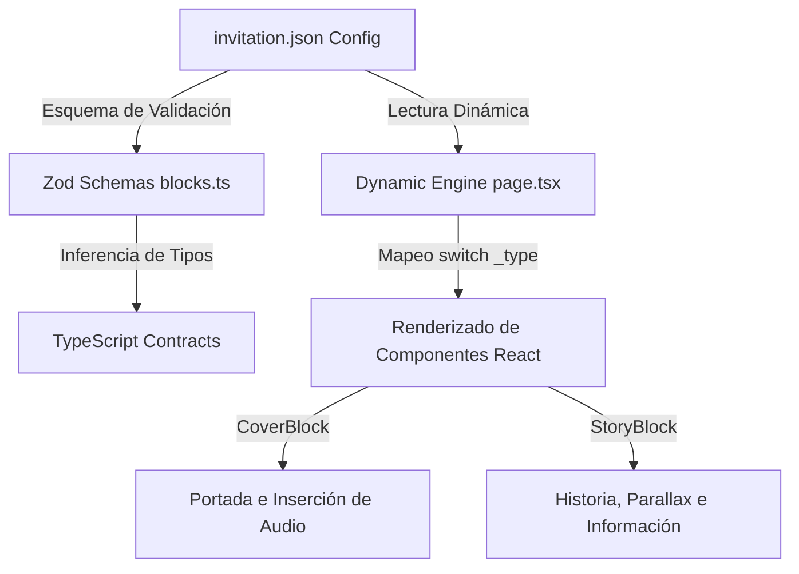

# 🌟 Smart Fest

**Smart Fest** es una plataforma open-source de vanguardia para la creación y renderizado de **invitaciones digitales interactivas**. El sistema está diseñado bajo una arquitectura modular de **Configuration-Driven UI (CDUI)** y **Component-Driven Design (CDD)**, emulando la filosofía de piezas de Lego.

Con Smart Fest, el contenido, orden y comportamiento de cada invitación se definen a través de un archivo de configuración JSON. Esto permite desacoplar completamente la lógica visual de la de datos, facilitando una escalabilidad e iteración excepcionales.

---

## 🚀 Arquitectura: El Concepto "Lego" (CDUI)

La interfaz se compone de bloques autónomos que se encuadran automáticamente en pantalla utilizando **CSS Scroll Snapping** de alta precisión.



1.  **Desacoplamiento Absoluto:** Cada sección (Portada, Historia, etc.) es un bloque modular independiente, agnóstico de dónde se posicione.
2.  **Validación Robusta:** Usamos **Zod** para definir esquemas y contratos de TypeScript automáticos en tiempo de ejecución. Si el JSON de configuración no es correcto, la aplicación previene fallas de renderizado.
3.  **Transiciones Naturales:** Habilitamos un sistema de snapping responsivo que fuerza a cada sección a abarcar exactamente el 100% del viewport (`h-screen`), interactuando de forma sutil y orgánica con el scroll.

---

## 🛠️ Stack Tecnológico

Elegimos tecnologías de punta para garantizar un rendimiento óptimo y una experiencia de desarrollo moderna:

*   **Framework:** [Next.js v16.2.6](https://nextjs.org/) (App Router, optimización de fuentes nativas y compilación de vanguardia).
*   **Biblioteca de UI:** [React v19.2.4](https://react.dev/).
*   **Estilos:** [Tailwind CSS v4.0.0](https://tailwindcss.com/) (soporte de variables nativas en CSS y animaciones fluidas).
*   **Tipografías:** `Playfair Display` (serif clásico editorial) y `Manrope` (sans-serif limpio).
*   **Validación:** [Zod v4.4.3](https://zod.dev/).
*   **Clases Dinámicas:** [clsx](https://github.com/lukeed/clsx) & [tailwind-merge](https://github.com/dcastil/tailwind-merge).

---

## ✨ Características del MVP Actual

### ✉️ Portada de Bienvenida (`CoverBlock`)
*   Simula la recepción de un sobre físico de invitación.
*   **Desplazamiento Sutil:** Botón de apertura con un scroll programático gradual (`parentContainer.scrollTo`) que se alinea suavemente con la segunda sección.
*   **Widget de Música Inteligente:** Un reproductor de música glassmorphic anclado localmente al Cover que sube y se oculta con este al hacer scroll. Evita bloqueos de reproducción automática de los navegadores (*autoplay bypass*) escuchando la primera interacción del usuario.

### 📸 Sección de Historia (`StoryBlock`)
*   **Efecto Parallax:** La foto de los novios de fondo se desplaza levemente en 2D al seguir el cursor del usuario en dispositivos de escritorio.
*   **Tarjeta de Información:** Tarjeta glassmorphic con diseño flotante y desenfoque que traduce la fecha/hora del JSON a lenguaje natural en español (ej. `"Sábado, 12 de Julio de 2025"`).
*   **Capas de Filtro:** Capas de viñeta rústica y degradado de color vino (`mulledwine`), con una textura sutil superpuesta de papel rugoso para brindar calidez.

---

## 🗺️ Roadmap de Colaboración

Queremos expandir Smart Fest para convertirlo en una solución integral de gestión de eventos. Los siguientes módulos están planificados:

*   `[ ]` **RSVP FormBlock:** Formulario de confirmación de asistencia en tiempo real conectado a base de datos (con control de alergias, invitados adicionales y canciones sugeridas).
*   `[ ]` **LocationBlock:** Mapas dinámicos (Google Maps / Waze) y botones de agenda (Google Calendar, iCal).
*   `[ ]` **Gestión de Invitados (Admin Dashboard):** Panel administrativo para los organizadores donde puedan ver confirmaciones y estadísticas del evento.
*   `[ ]` **IA de Redacción y Ubicación:** Integración de Inteligencia Artificial para redactar frases emotivas personalizadas y optimizar la acomodación de invitados en mesas.

---

## 🛠️ Guía Rápida de Inicio

1.  **Clonar el repositorio:**
    ```bash
    git clone https://github.com/ikeredu/smart-fest.git
    cd smart-fest
    ```

2.  **Instalar dependencias:**
    ```bash
    npm install
    ```

3.  **Iniciar el entorno de desarrollo:**
    ```bash
    npm run dev
    ```

4.  **Abrir el navegador:**
    Visita [http://localhost:3000](http://localhost:3000) para ver la invitación interactiva en tiempo real.

---

## 🤝 Colaboración

¡Las contribuciones son bienvenidas! Consulta nuestro archivo [CONTRIBUTING.md](./CONTRIBUTING.md) para conocer las reglas de código, arquitectura de carpetas y cómo comenzar a añadir tus propios bloques.
